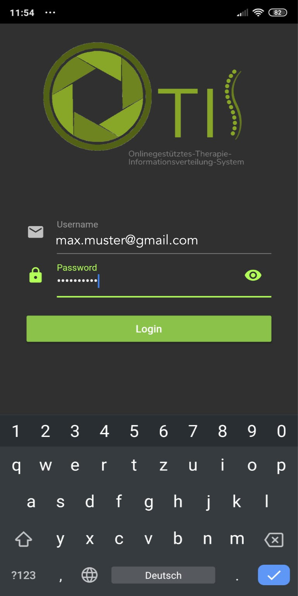
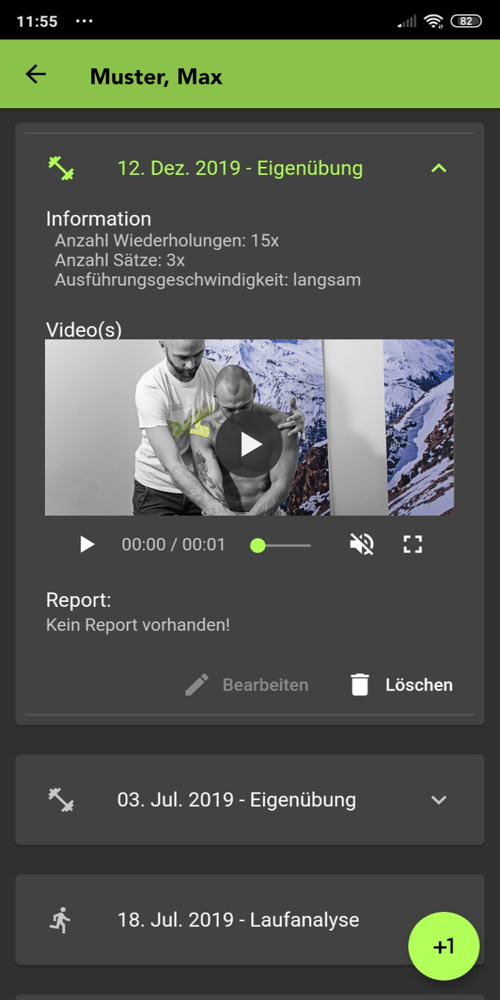
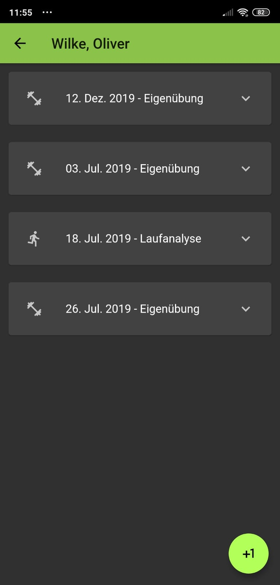
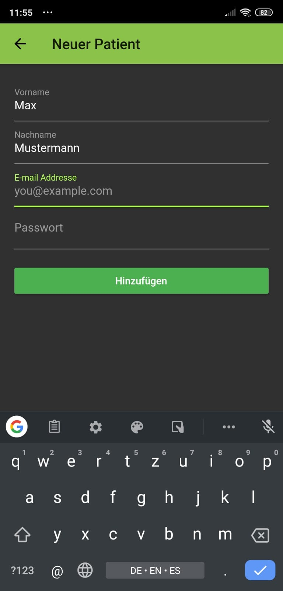
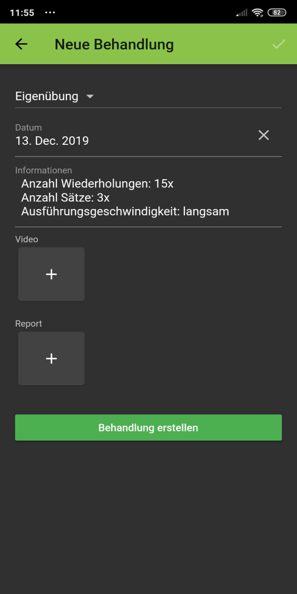

# OTIS
OTIS stands for "Onlinegestütztes Therapie-Informationsverteilung-System" and was a project of the physiotherapy clinic "Physioteam Gündel" to better manage self-exercises for patients and to provide patients with instructions with video. Otis began as a customized Wordpress, but later a smartphone app for iOS and Android was developed with Flutter as a user-friendly frontend. The project was discontinued in 2019 and the code has not been maintained since then. Nevertheless, I would like to make the code of the Flutter App available here in the hope that others may be able to learn from it. 

## Screenshots

